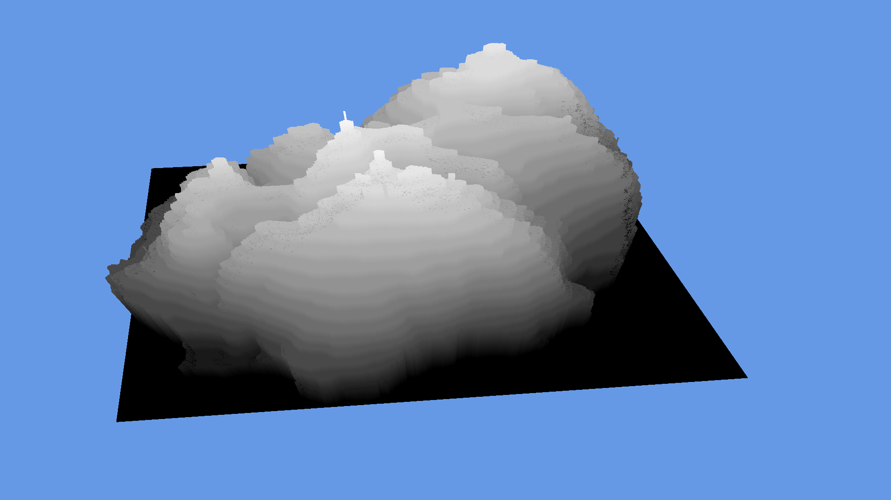

VoxeGLSL
========

Simple Voxel engine used to display heightmap in 3D. The engine use OpenGL 3.x with Geometry Shader to generate cubes on GPU.


# Usage

```
cd src
make
./voxel heightmap.png
```

# Controls

* `W`, `S` => Move front and back
* `A`, `D` => Left and Right
* `Z`, `X` => Up and downd
* `Arrows` => Rotate arround

# Example


